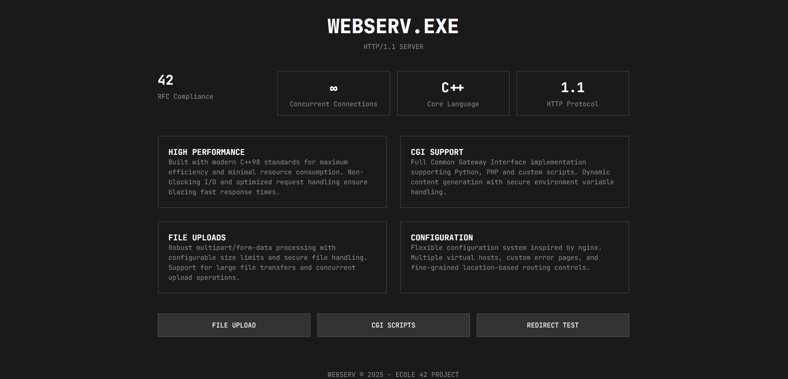
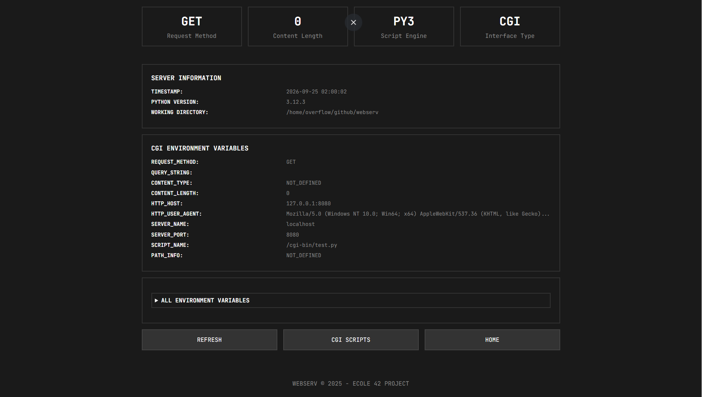
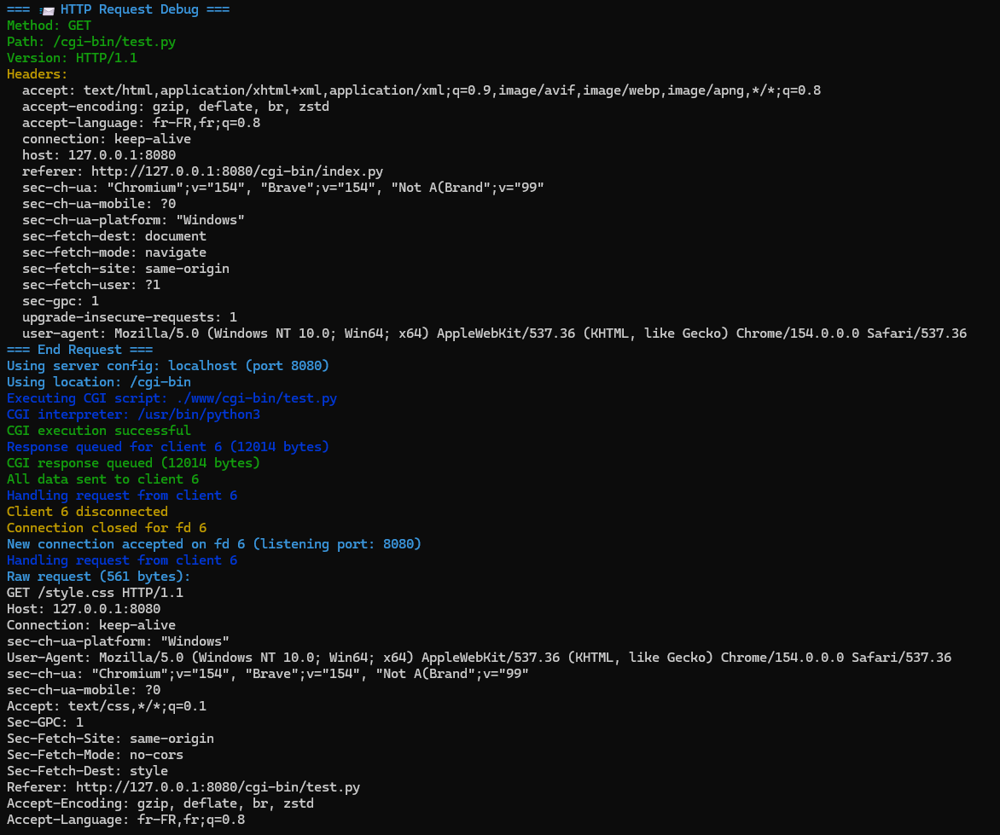
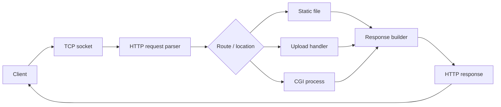

# WebServ

A small HTTP server written from scratch in **C++98** as part of the 42 curriculum.

The goal is not to replace a production web server such as Nginx. The point is to understand what happens underneath it: sockets, HTTP parsing, routing, responses, uploads, CGI execution and configuration.

## Highlights

- TCP socket creation and connection handling
- HTTP request parsing and response generation
- Configurable virtual servers and locations
- `GET`, `POST` and `DELETE` handling
- Custom error pages
- Request body size limits
- File uploads
- CGI execution
- Redirects
- Directory auto-index support
- Multiple server blocks / listening ports

## Demo

The repository includes a small test front-end served directly by WebServ. It provides entry points for the main features implemented by the server and makes it easier to exercise the project from a browser.

<p align="center">
  
</p>

### CGI execution

WebServ can route configured extensions to an external CGI interpreter. The server builds the CGI environment from the incoming HTTP request and the selected server/location configuration before executing the script.

<p align="center">
  
</p>

The same execution can be followed from the server side: request parsing, location resolution, interpreter selection, CGI execution and response delivery are all visible in the runtime logs.

<p align="center">
  
</p>

Additional screenshots, including a dynamic quote example and request parsing traces, are available in [`screenshots/`](screenshots/).

## Request flow



## Project structure

```text
WebServ/
├── configs/         # Server configuration files
├── includes/        # C++ interfaces
├── src/
│   ├── cgi/
│   ├── config/
│   ├── fileupload/
│   ├── http/
│   ├── response/
│   ├── server/
│   └── utils/
├── www/             # Example web root
└── www_example/     # Additional virtual-server content
```

## Build

Requirements: a C++ compiler with C++98 support, GNU Make and a Unix-like environment.

```bash
make
```

Then start the server with a configuration file:

```bash
./webserv configs/default.conf
```

The included example configuration exposes servers on ports `8080`, `8081` and `8082`.

## Example configuration

```nginx
server {
    listen 8080;
    server_name localhost;
    root ./www;
    index index.html;

    location / {
        allowed_methods GET POST;
        autoindex off;
    }

    location /cgi-bin {
        allowed_methods GET POST;
        cgi_extension .py;
        cgi_path /usr/bin/python3;
    }
}
```

## What this project demonstrates

WebServ is primarily a systems and networking project. It required turning a textual protocol into a working server architecture while dealing with partial I/O, connection state, malformed input, configuration, resource management and the boundary between the server and external CGI programs.

---

Part of my developer portfolio: **[github.com/Overflow-ADW](https://github.com/Overflow-ADW)**  
Professional work: **[Avenue du Web](https://avenueduweb.be)**
